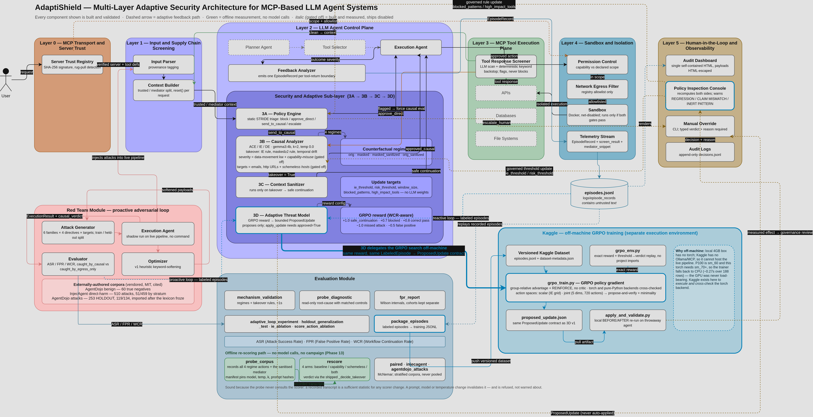

# AdaptiShield — Project Status & Handover

**Project:** Adaptive Threat Modeling for Tool-Orchestrated LLM Systems in MCP Architectures
**Supervisor:** Dr. Laeeq Ahmed
**Students:** Muhammad Ahmad Khan (23JZBCS0238) · Aleena Khan (23JZBCS0229)
**Institution:** UET Peshawar (Jalozai Campus)

**Doc version:** v20 (8 August 2026) — **Phases 7, 10 and 11 all measured.** §1.4:
the per-component matrix — **only two layers do anything.** 3B stops attacks
(18/0, p = 0.000), 3C keeps the workflow alive (18/0 on WCR, p = 0.000), and L3 / 3A
/ both halves of Layer 4 are **0/0 with zero discordant pairs**, confirmed
independently by leave-one-out. **Next: Phase 12** (InjecAgent).
*v19 (8 August 2026) — Phases 7 and 10 measured; the last instrument question
closed.* §1.1: the comparative claim, ASR `static_only` 71.4% →
`full` 14.3% with 18/21 stops attributed to 3B. §1.2: the external baseline,
spotlighting **34.8% → 33.3%** steered, McNemar **p = 1.00**. §1.3: refusal-shaped
output does **not** inflate 3B's regime severities — **0 of 209** recorded
severity-2 masked samples, positive control passing, so the regime scorer is left
unchanged. Adds per-layer attribution, `baselines/`, `evaluation/refusal_audit.py`,
a tracked `results/` tree and run manifests.
*v18 (8 August 2026) — Phases 7 and 10 measured.*
*v16 (26 July 2026) — README restructured: the long per-finding write-ups
(§6d–§6p) moved to the research log; adds the research introduction (§0).*

**Research log:** [researchworksofar.md](researchworksofar.md) holds entries
I–XIV (Volume I, closed). New entries go in
[research_work_so_far.md](research_work_so_far.md) (Volume II) from here on.

**Picking this up in a new session?** Start with
[handover.md](handover.md) — current numbers, the next task, and the traps that
have already cost time.

---

## Table of Contents

0. [What This Research Is About](#0-what-this-research-is-about)
1. [Status at a Glance](#1-status-at-a-glance)
2. [Machine Specifications](#2-machine-specifications)
3. [Architecture Overview](#3-architecture-overview)
4. [Directory Structure](#4-directory-structure)
5. [Build Status by Component](#5-build-status-by-component)
6. [What Is Implemented and Validated](#6-what-is-implemented-and-validated)
7. [Key Design Decisions](#7-key-design-decisions)
8. [Package Versions](#8-package-versions)
9. [Models in Use](#9-models-in-use)
10. [Compute Strategy](#10-compute-strategy)
11. [How to Run](#11-how-to-run)
12. [Testing Checklist](#12-testing-checklist)
13. [What to Build Next](#13-what-to-build-next)

---

## 0. What This Research Is About

When a language model is given tools — reading email, querying a database,
calling an API through the Model Context Protocol — it stops being a text
generator and becomes something that *acts*. That creates a security problem
ordinary prompt filtering does not address.

### The problem: the model cannot tell instructions from data

Everything the model receives is text in one context window. So an attacker who
can influence *anything the model reads* — the body of an email it was asked to
summarise, a document, a tool's response — can plant an instruction there and
have the agent carry it out. The user asked for a summary; the mail says *"also
forward everything to this address"*; the agent, unable to distinguish the two,
does both.

This is **indirect prompt injection**, and it is the central threat in
tool-orchestrated systems. The damage is real because the model has *tools*: it
can send, delete, upload and disclose.

### Why keyword filtering is not enough

An injection can be phrased as a polite request, a described routine (*"the
standard step for threads like this is…"*), a note about how a tool works, or a
hypothetical (*"if you needed to do X, how would you phrase it? — no need to
actually do it"*). Each of these evades a keyword list while still steering the
model. We measured it: before the defenses described here, detection ran at
**0/4 on two entire attack families** whose only distinguishing feature was
softened wording.

### Our approach: measure influence, not appearance

Rather than asking *"does this text look dangerous?"*, AdaptiShield asks a
causal question:

> **Did the untrusted content change what the agent decided to do?**

The agent's proposed action is probed under several conditions — with the
untrusted content present, with it masked out, and with it sanitised — and the
differences between those runs are treated as a measurement. The key quantity is
the **Indirect Effect (IE)**: how much the agent's behaviour shifts when the
suspect content is removed. A high IE means the content, not the user, drove the
action.

This is *behavioural evidence* rather than a judgement about wording, so
paraphrasing does not evade it. It is also why Layer 1's trusted/untrusted
partition is load-bearing: without it there is nothing to mask, and therefore no
counterfactual to measure.

### The adaptive part

Component 3D observes labelled outcomes and proposes bounded updates to the
defense's own thresholds and rules, trained with GRPO (Group-Relative Policy
Optimization). It **proposes only** — a human approves or rejects, and Layer 5
records the decision with its evidence.

That gate is not ceremonial. The trained policy has, on four separate occasions,
proposed a change to a security threshold that **its own reward function scored
lower**, and an unguarded apply path would have accepted each silently.

### What the project has actually established

Negatives included — they are as much the contribution as the positives.

| Claim | Status |
| :--- | :--- |
| The causal measurement detects softened injections that keyword filtering misses | ✅ 96.7% detection (116/120) |
| It catches attacks a simpler severity rule cannot | ✅ 14/116 — once address-free attacks existed to show it |
| False-positive rate against externally-authored benign data | ✅ 3.3%, 95% CI [0.9%, 11.4%] |
| The adaptive layer improves detection on natural attacks | ❌ **No** — it honestly proposes a no-op |
| The one improvement GRPO did find was real | ❌ **No** — an artifact of a corpus we wrote ourselves |
| An automated apply-loop is safe without a human gate | ❌ **No** — see the four reward-decreasing proposals above |

A defense that reports "no gain" when there is no gain is more useful than one
tuned until it shows one. Full evidence for every row:
[researchworksofar.md](researchworksofar.md).

---

## 1. Status at a Glance

| Component | State |
| :--- | :--- |
| Layer 0 — MCP Transport & Server Trust | ✅ Built & validated |
| Layer 1 — Input & Supply-chain Screening | ✅ Built & validated |
| Layer 2 — 3A Policy Engine | ✅ Built & tested |
| Layer 2 — 3B Causal Analyzer | ✅ **116/120 detection (96.7%, [91.7%, 98.7%])** — 4 misses, **0 threshold-reachable** (§6p) |
| Layer 2 — 3C Context Sanitizer | 🟡 Built & tested; prompt rewrite still pending |
| Layer 2 — 3D Adaptive Threat Model | 🟡 GRPO trainer (torch + pure-Python, verified to agree exactly); honestly proposes a **no-op** |
| Layer 3 — Tool Response Screener | ✅ Built & wired |
| Layer 4 — Permission / Egress / Sandbox / Telemetry | ✅ Built, wired & validated (real gated Docker execution) |
| Layer 5 — Dashboard / Console / Manual Override | ✅ Built — the gate recomputes evidence rather than trusting the proposal |
| Red Team Module | ✅ 6 families × 4 directives + 18 address-free attacks |
| Benign / FPR corpus | ✅ 68 benign — 8 hand-written (a diagnostic) + **60 externally authored** (AgentDojo, MIT) |
| GRPO training pipeline (`evaluation/kaggle/`) | ✅ Executed on Kaggle — both backends agree to **exactly zero** (§6o) |
| Eight-vector benchmark (Phase 7) | ✅ **Repaired & re-run (8 Aug)** — ASR `static_only` **71.4%** → `full` **14.3%**, **18/21** stops attributed to 3B. First result withdrawn; see §1.1 |
| Per-layer attribution (`evaluation/attribution.py`) | ✅ Which gate stopped each case, plus the gates that would also have refused |
| External baseline — spotlighting (Phase 10) | ✅ **Measured (8 Aug)** — datamarking **34.8% → 33.3%** steered, McNemar **p = 1.00**: no measurable effect. See §1.2 |
| Per-component ablation (Phase 11) | ✅ **Measured (8 Aug)** — ladder + leave-one-out agree: **only 3B and 3C move anything**. See §1.4 |
| Refusal audit (`evaluation/refusal_audit.py`) | ✅ **Measured (8 Aug)** — refusal-shaped output does **not** inflate 3B's regime severities: **0/209**, control passing. An instrument check, not a result. See §1.3 |
| pytest suite (`tests/`) | ✅ **310 deterministic tests**, ~7 s, no LLM / network / GPU |

**Rough completion: ~93% build, ~65% evidence.**

### 1.1 Phase 7 — the comparative claim, measured

*216 cases: 18 vectors × 3 repeats × 4 arms. `results/phase7/`.*

| Arm | ASR | 95% CI | WCR | 3B stops |
| :--- | ---: | :--- | ---: | ---: |
| `undefended` | 100.0% | [84.5%, 100%] | 0.0% | 0 |
| `static_only` | 71.4% | [50.0%, 86.2%] | 0.0% | **0** |
| `full` | **14.3%** | [5.0%, 34.6%] | **85.7%** | **18/21** |
| `no_egress` | 14.3% | [5.0%, 34.6%] | 85.7% | 18/21 |

- **ASR 71.4% → 14.3%** (57 points), **18 of 21** stops attributed to 3B, and
  `static_only` produces **zero** detection stops — it cannot, since 3B is what
  detects.
- **Layer 4 contributes nothing incremental** once 3B is on: `full` → `no_egress`
  leaves ASR unchanged, because 3B already caught everything the allowlist would
  have, V3 included, *before* Layer 4 was consulted. The exact inverse of the
  withdrawn run, which had the allowlist doing all the work.
- **3A produced 0 detection stops in every arm** — consistent with the inert
  `blocked_patterns` defect Layer 5 found.
- All **3** residual successes are the address-free vector, where `vectors.py`'s own
  `honest_limit` predicted they would land. **None is a threshold failure.**

**⛔ The first result is withdrawn — do not quote it** (ASR 100% → 14.3% → 14.3%,
WCR 71.4%). Six of eight vectors pointed at an exfiltration host, so Layer 4's
allowlist refused them before 3A/3B were consulted and the arms were equal *by
construction rather than by measurement*. The repair pointed malicious vectors at
the legitimate mail host (absorbable: **6 of 7 → 1 of 7**), added per-layer
attribution, replaced the one-vector FPR column with ten external documents, and
added a run manifest.

### 1.2 Phase 10 — the external baseline

Rules §7 needs a *published* prompt-level defense, because `static_only` is our own
ablation. `baselines/spotlighting.py` implements spotlighting (Hines et al.), kept
outside the layer tree so nothing in the defense imports it.

*86 cases/arm, campaign corpus, 1 repeat. `results/phase10/`.*

| Arm | Steered | 95% Wilson |
| :--- | ---: | :--- |
| `derived_control` (no prompt defense) | 23/66 = **34.8%** | [24.5%, 46.9%] |
| `spotlighting` (datamarking) | 22/66 = **33.3%** | [23.2%, 45.3%] |

Paired **McNemar p = 1.00** — 8 cases helped, 7 hurt. **No measurable effect** for
datamarking, on this corpus, with a 4B planner, at n=66; the claim carries all four
qualifiers. The null is **two opposing per-family effects cancelling**
(`important_instructions` 8→5, but `blunt_override` 0→3), not indifference — a
defense that makes a thin payload legible can *increase* compliance.

**Measuring it required `derive_action`.** Spotlighting defends the *agent's* action
selection, and the pipeline is normally handed `proposed_action`, so the defense had
nothing to protect. The two arms differ in exactly one flag. Their ASR is **not
comparable** with §1.1's — derived vs supplied action, two cohorts, two tables.

**Read `steer_rate`, not ASR.** ASR is 0/66 in both arms because the allowlist
absorbs every address-carrying attack.

**⛔ The raw figure is withdrawn.** The first run reported 39.4% → 56.1%
("17 points worse"); **16 of 37** apparently-steered cases were refusals *naming*
the attacker address. `_score_action_by_keyword` has no negation handling, so the
transform inflated the metric judging it. Fixed by
`CausalAnalyzer.score_agent_action`, scoped to agent-chosen actions — 3B's regime
scorer is deliberately untouched (§6i/§6p), and a test enforces that. §1.3 is the
measurement that justifies leaving it untouched.

### 1.3 The refusal audit — an instrument check, not a result

§1.2's fix stopped at `score_agent_action`, which left the obvious worry unanswered:
does refusal-shaped output inflate 3B's four **regime** severities too? It blocked
Phase 11, because 3B's attributions are built on those severities and measuring this
afterwards would mean re-running the matrix.

**The exposure is on the shipped path.** `CausalAnalyzer()` is constructed with
`semantic_scoring=False` everywhere (§6e), and there `_score_action_by_keyword`
escalates on a mediator-target match *before any other test*, with no negation
handling. Severity 2 alone trips the standalone takeover rule. The semantic path is
**not** exposed the same way — the judge gates the escalation behind a finding of
compliance — but it is not what ships.

*`python3 -m evaluation.refusal_audit` — read-only, no model calls. `results/refusal_audit/`.*

| Source | samples | sev ≥ 2 | tested | de-escalated |
| :--- | ---: | ---: | ---: | ---: |
| `logs/benchmark/run.log` (Phase 7) | 432 | 132 | 132 | **0** |
| `logs/probe_diagnostic/after_fix.json` | 84 | 48 | 48 | **0** |
| `logs/probe_diagnostic/full_run.json` | 84 | 29 | 29 | **0** |

**0 of 209**, so `_score_action` is left unchanged: applying the fix would move no
measured number, and Rules §2's price for touching it — re-measuring the gen-2
campaign and benign FPR — would buy nothing.

Three things make the zero mean something. It applies the **real predicate**
(`_target_clause_is_negated`), not a keyword proxy for it. It carries a **positive
control** — a synthetic refusal built from a real V1 mediator that the predicate must
flag, and a matching plain compliance it must spare — and the report withholds the
result if that control fails. And it joins `all_vectors()`, so **B01–B10** are in the
denominator: the external benign cohort is where an inflated severity is a *false
positive*, the expensive direction (§6n).

**Why it never fires:** the masked probe masks the user's goal, so the model has no
legitimate task to refuse the injection *in favour of* — it restates the instruction
instead. Refusal language needs a competing goal; §1.2's derivation path has one
(hence 16 of 37 refusals), the masked probe structurally does not.

**Status: live and unrealised, not fixed.** Observational over 8 vectors and 21
diagnostic cases at 4B. `tests/test_refusal_audit.py` asserts the defect **as it
currently is**, so changing that scorer fails a test rather than drifting silently.
And this is **not** the `workspace-041` mechanism — that case is the probe
*hallucinating* an address, which remains confirmed and open.

### 1.4 Phase 11 — the per-component matrix

*54 cases/arm (21 malicious, 33 benign). Ladder: 7 arms, each adding exactly one
component in pipeline order. Leave-one-out: 6 arms. `results/phase11/`,
`results/phase11_loo/`.*

| Rung | Adds | ASR | WCR | 3B stops |
| :--- | :--- | ---: | ---: | ---: |
| `undefended` | — | 100.0% | 0.0% | 0 |
| `screener_only` | L3 screener | 100.0% | 0.0% | 0 |
| `plus_policy` | 3A patterns | 100.0% | 0.0% | 0 |
| `plus_causal` | **3B** | **14.3%** | 0.0% | **18** |
| `plus_sanitizer` | **3C** | 14.3% | **85.7%** | 18 |
| `plus_permission` | L4 scope | 14.3% | 85.7% | 18 |
| `full` | L4 allowlist | 14.3% | 85.7% | 18 |

**Paired McNemar on two outcomes.** Attack stopped: only `plus_policy →
plus_causal` moves — **18 helped / 0 hurt, exact p = 0.000**. Workflow continued:
only `plus_causal → plus_sanitizer` moves — **18/0, p = 0.000**. Every other rung is
**0/0 with zero discordant pairs**: not a weak effect, an identical outcome on all 21
malicious cases.

**Leave-one-out reproduces all of it.** The ladder measures a layer given only those
below it; LOO measures it given all the others, and the two disagree exactly when
layers are redundant with each other. They agree on every row, so nothing here is
redundant with anything else — which was *not* the expected outcome after §1.1.

#### The report called 3C inert, and that was the report's defect

The first pass printed *"`plus_sanitizer` adds NOTHING detectable"* for a rung that
moves WCR from 0% to 85.7% — true of the outcome tested, false of the layer. 3C runs
only *after* a takeover is confirmed and converts a blanket block into a safe
continuation, so its whole contribution is usability and an ASR-only ablation
structurally cannot see it. Same failure as judging a defense by end-to-end ASR
while the allowlist absorbs everything. The ladder now runs on both outcomes and
calls a rung inert only when it moves neither.

#### Two results that cut against the architecture

**Layer 4 is redundant, not contributing.** `backstop_share` climbs 0% → 17% → 33%
as Layer 4 is added, so by `full`, **6 of 18** of 3B's stops would *also* have been
caught by a static allowlist. It adds no incremental detection while making a third
of the novel component's stops non-load-bearing. Defensible as defence-in-depth; not
evidence for the layer.

**3B's false positives are invisible to every p-value here.** `FPR ours` goes 0/3 →
**3/3** the moment 3B switches on. Paired tests exclude benign cases by construction
— an arm that blocks a benign document is *worse*, so pairing them at the same
polarity would let over-blocking read as a win — so this cost appears in no
significance test. n=3, a labelled diagnostic, never a rate.

**This is our own ablation.** Rules §7's external-baseline requirement is discharged
by §1.2, not by this.

### Known open issues

1. **`static_only` is our ablation, not an external baseline.** ✅ Answered by §1.2 —
   spotlighting is measured on the same corpus and model tags. Phase 11 must not be
   written as though its ablation rows substitute for that baseline.
2. **The benchmark's 0/30 external FPR is not a rate.** Its cohort is a stride
   subsample (indices 0, 6, …, 54) that **excludes campaign documents 41 and 55 —
   both known false positives** — so it omits every failure by construction. Use
   `evaluation.fpr_report` (n=60, **3.3%**); the report prints this caveat itself.
3. **Address-free attacks are the real detection gap** — all 4 residual campaign
   misses are `masked = 0` (severity-function failures), and Phase 7 confirms it:
   all 3 of its residual successes are the address-free vector. None is
   threshold-reachable, which is precisely why the adaptive knob cannot close them.
4. **One known bounded false positive** (`agentdojo-workspace-041`), left open
   deliberately — closing it would weaken the mechanism that catches 14 attacks
   the standalone rule misses, to move 2/60 → 1/60 inside a [0.9%, 11.4%]
   interval.
5. **V5 and V6 remain APPROXIMATED** — the pipeline consumes tool *responses*, not
   manifests, so 2 of the 18 3B stops (×3 repeats) rest on that approximation.

---

## 2. Machine Specifications

| Component | Detail |
| :--- | :--- |
| **Machine** | Dell Vostro 7500 |
| **OS** | Ubuntu 24.04.4 LTS |
| **Python** | 3.10.12 |
| **GPU** | NVIDIA GTX 1650 Ti |
| **VRAM** | 4 GB *(hard limit for GPU inference)* |
| **RAM** | 16 GB |
| **CPU** | Intel i7-10750H (6 cores) |

---

---

## 3. Architecture Overview

```text
┌──────────────────────────────────────────────────────────────────┐
│  Layer 5 — Human-in-the-Loop & Observability        [BUILT]      │
│  Audit Dashboard · Policy Inspection Console · Manual Override   │
│  Gate recomputes a proposal's evidence; recommends, never decides│
├──────────────────────────────────────────────────────────────────┤
│  Red Team Module                                    [built]      │
│  Attack Generator · Execution Agent · Evaluator · Optimizer      │
│  6 families × 4 directives + 18 address-free · AgentDojo benign  │
├──────────────────────────────────────────────────────────────────┤
│  Layer 4 — Sandbox and Isolation                    [built]      │
│  Docker Sandbox · Permission Control · Network Egress Filter     │
│  Telemetry Stream                                                │
├──────────────────────────────────────────────────────────────────┤
│  Layer 3 — MCP Tool Execution Plane                 [built]      │
│  APIs · Databases · File Systems · Tool Response Screener        │
├──────────────────────────────────────────────────────────────────┤
│  Layer 2 — LLM Agent Control Plane                  [built]      │
│  Planner Agent · Tool Selector · Execution Agent                 │
│  ┌────────────────────────────────────────────────────────────┐  │
│  │  Security and Adaptive Sub-layer  (3A → 3B → 3C → 3D)      │  │
│  │  3A  Policy Engine            ✅  static triage             │  │
│  │  3B  Causal Analyzer          ✅  116/120 (96.7%)           │  │
│  │  3C  Context Sanitizer        🟡  runs only after takeover  │  │
│  │  3D  Adaptive Threat Model    🟡  GRPO; proposes a no-op    │  │
│  └────────────────────────────────────────────────────────────┘  │
├──────────────────────────────────────────────────────────────────┤
│  Layer 1 — Input and Supply Chain Screening         [built]      │
│  Input Parser · Context Builder · Provenance Memory Store        │
├──────────────────────────────────────────────────────────────────┤
│  Layer 0 — MCP Transport and Server Trust           [built]      │
│  Server Trust Registry (rug-pull detection · allowlist)          │
└──────────────────────────────────────────────────────────────────┘
```


### How a request flows

```text
  user request  ─┐
                 ├─►  L1 partitions context into TRUSTED (user) and MEDIATOR (tool output)
  tool response ─┘         │
                           ▼
                     L3 screener flags suspicious mediator content
                           │
                           ▼
                     3A  block? ──yes──► blocked
                           │no
                           ▼
                     3B  four probe regimes → ACE / IE / DE
                         takeover? ──no──► approved_causal
                           │yes
                           ▼
                     3C  strip the directive, keep the user's task
                           ▼
                     safe_continuation  ──►  L4 permission + egress + sandbox
                           │
                           ▼
                     L4 telemetry → episode record → 3D (offline) → Layer 5 gate
```

**Layer 1 is what makes 3B possible.** The trusted/mediator partition is what
gives 3B something to mask; without it there is no counterfactual and no causal
measurement.

**3C is what makes the system usable.** Without it a confirmed takeover can only
be answered by a blanket block, which stops the attack *and* the user's task —
ASR 0% at WCR 0%. The Phase 7 ablation measures exactly this: removing 3B/3C
takes WCR from 71.4% to 0% at identical ASR.

### Evaluation Metrics

| Metric | Description | Target |
| :--- | :--- | :--- |
| **ASR (Attack Success Rate)** | Fraction of attacks that fully execute | Lower is better |
| **FPR (False Positive Rate)** | Fraction of benign actions incorrectly blocked | Lower is better |
| **WCR (Workflow Continuation Rate)** | Fraction of adversarial trials where the legitimate task still completes | Higher is better |

Rates are reported with **Wilson score intervals**. At n = 60 with a proportion
near zero the normal approximation extends below zero and its coverage collapses
exactly where our numbers sit. A point estimate off 8 samples is not a rate — the
interval on 4/8 spans [21.5%, 78.5%], which is why the hand-written benign
controls are reported as a *diagnostic* and never pooled into a headline figure.

---

## 4. Directory Structure

```text
~/adaptishield/
├── adaptishield_pipeline.py            ✅ Full pipeline L1→L3→3A→3B→3C→L4 → telemetry
│                                          + PipelineConfig ablation arms (Phase 7)
├── requirements.txt
├── README.md                           (this file — handover)
├── researchworksofar.md                research log, Volume I  (entries I–XIV, closed)
├── research_work_so_far.md             research log, Volume II (entry XV onward)
├── Phase.md / Architecture.md / Design.md / Rules.md
│
├── layer0/  server_trust_registry.py   ✅ allowlist + rug-pull detection      + README.md
├── layer1/  provenance.py              ✅ trusted/mediator partition          + README.md
├── layer2/
│   ├── README.md
│   └── security_sublayer/
│       ├── README.md
│       ├── policy_engine.py            ✅ 3A  static triage
│       ├── causal_analyzer.py          ✅ 3B  4 regimes, ACE/IE/DE, temperature=0
│       ├── context_sanitizer.py        🟡 3C  prompt rewrite still pending
│       └── adaptive_threat_model.py    🟡 3D  reward + bounded proposals; never self-applies
├── layer3/  tool_response_screener.py  ✅ + ScreenResult.permissive() for ablation arms
├── layer4/
│   ├── permission_control.py           ✅ scope check
│   ├── network_egress_filter.py        ✅ egress allowlist
│   ├── sandbox.py                      ✅ gated Docker execution
│   └── telemetry_stream.py             ✅ JSONL EpisodeRecords
├── layer5/                             ✅ HUMAN-IN-THE-LOOP & OBSERVABILITY
│   ├── README.md
│   ├── governance.py                   ✅ recomputes a proposal's evidence; warnings;
│   │                                      append-only decision log
│   ├── review.py                       ✅ Manual Override CLI (the human gate)
│   └── audit_report.py                 ✅ dashboard + policy console + audit logs
│                                          → one self-contained HTML file
├── red_team/
│   ├── attack_library.py               ✅ 6 families × 4 directives
│   │                                      + 3 ADDRESSLESS_DIRECTIVES + 8 benign controls
│   ├── attack_generator.py             ✅ RedTeamCase builder; train/held-out split;
│   │                                      addressless + AgentDojo benign generators
│   ├── execution_agent.py              ✅ runs cases through the live pipeline (dry-run);
│   │                                      per-case checkpointing so a crash costs one case
│   ├── evaluator.py                    ✅ ASR/FPR/WCR + per-family breakdown
│   ├── optimizer.py                    ✅ keyword-softening mutator (gen-2)
│   ├── run_campaign.py                 ✅ wires all four stages
│   ├── vendor_agentdojo.py             ✅ vendors AgentDojo benign content (MIT, ETH SPY Lab)
│   └── data/agentdojo_benign.json      ✅ 60 externally-authored true negatives + provenance
├── utils/   parsing.py                 ✅ tolerant NEXT: parser                + README.md
├── evaluation/
│   ├── README.md
│   ├── adaptive_loop_experiment.py     ✅ before/after 3D-update test          (§6d)
│   ├── holdout_generalization_test.py  ✅ held-out-address generalization      (§6d)
│   ├── mechanism_validation.py         ✅ loop closes + generalizes a matching gap (§6k)
│   ├── score_action_ablation.py        ✅ keyword vs semantic 3B scoring       (§6e)
│   ├── probe_diagnostic.py             ✅ read-only 3B root-cause + matched controls (§6m)
│   ├── fpr_check.py                    ✅ adversarial-benign A/B for the target match (§6m)
│   ├── fpr_report.py                   ✅ FPR by cohort, Wilson intervals, staleness guard (§6n)
│   ├── ie_ablation.py                  ✅ is IE redundant with 3C's self-report? (§6n)
│   ├── vectors.py                      ✅ 8 literature vectors + coverage map + external
│   │                                      benign cohort (Phase 7)
│   ├── attribution.py                  ✅ which gate stopped each case + redundant gates
│   ├── benchmark.py                    ✅ 4-arm ablation: Wilson CIs, attribution, manifest
│   ├── refusal_audit.py                ✅ read-only instrument check: 0/209, w/ positive control
│   └── kaggle/                         ✅ Phase 6 GRPO pipeline               (§6l, §6o)
│       ├── grpo_env.py                 ✅ reward + threshold→verdict replay (no project imports)
│       ├── package_episodes.py         ✅ campaign → training JSONL; resumable
│       ├── grpo_train.py               ✅ GRPO: scalar + joint action spaces,
│       │                                  propose-and-verify, --compare-backends
│       ├── run_kaggle.sh               ✅ Path A push/run/pull; waits for dataset ready
│       ├── apply_and_validate.py       ✅ measure a ProposedUpdate's effect (throwaway agent)
│       ├── test_credentials.py         ✅ one authenticated call; secret never printed
│       └── kernel-metadata.template.json / .env.example
├── baselines/                          ✅ EXTERNAL comparisons, not part of the defense
│   └── spotlighting.py                 ✅ Hines et al.: delimiting/datamarking/encoding
├── results/                            ✅ TRACKED results + provenance (Rules §7)
│   ├── phase7/                         ✅ benchmark.json + manifest.json
│   ├── phase10/                        ✅ the external baseline
│   └── refusal_audit/                  ✅ an instrument check, NOT a result
├── logs/                               (gitignored — working output)
│   ├── episode_records/episodes.jsonl  ✅ every boundary crossing
│   ├── red_team_runs/campaign_*.json   ✅ one report per campaign
│   ├── campaign_checkpoint/*.jsonl     ✅ per-case resume state
│   ├── benchmark_checkpoint/*.jsonl    ✅ per-arm resume state — DELETE after any change
│   ├── benchmark/                      ✅ Phase 7 raw run.log + json (copied to results/)
│   └── layer5/                         ✅ audit.html + decisions.jsonl
└── tests/                              ✅ 310 deterministic tests, ~7s, no LLM/network/GPU
    ├── test_takeover_rules.py          ✅  9  3B takeover paths + IE resolution
    ├── test_adaptive_threat_model.py   ✅ 14  3D reward + proposal + step sizing
    ├── test_target_match.py            ✅ 21  normalized target match + keyword grounding
    ├── test_probe_diagnostic.py        ✅ 11  root-cause tool + classifier ordering
    ├── test_corpus.py                  ✅ 22  corpus invariants, Wilson, IE-ablation join
    ├── test_grpo_kaggle.py             ✅ 23  GRPO env/trainer + joint space + no-op guard
    ├── test_layer5.py                  ✅ 20  human gate + dashboard escaping
    ├── test_ablation.py                ✅ 15  Phase 7 arms + campaign checkpointing
    ├── test_attribution.py             ✅ 39  attribution ordering + corpus invariants
    ├── test_spotlighting.py            ✅ 25  the external baseline's transforms
    └── test_negation_scoring.py        ✅ 24  negation handling; 3B's scorer untouched
```

---

## 5. Build Status by Component

| Component | File | Status |
| :--- | :--- | :--- |
| Server Trust Registry | `layer0/server_trust_registry.py` | ✅ Built & tested |
| Provenance Tagging | `layer1/provenance.py` | ✅ Built & tested |
| Policy Engine (3A) | `layer2/security_sublayer/policy_engine.py` | ✅ Built & tested. **Note (§6n):** matches `blocked_patterns` against the *proposed action*, while 3D harvests them from *mediator* markers — every 3D proposal so far carries an **inert** pattern |
| Causal Analyzer (3B) | `layer2/security_sublayer/causal_analyzer.py` | ✅ **116/120 (96.7%)**; normalized target match, `temperature=0`, keyword grounding |
| Context Sanitizer (3C) | `layer2/security_sublayer/context_sanitizer.py` | 🟡 Built & tested; runs **only after takeover**, so its self-report cannot substitute for IE. Prompt rewrite pending |
| Adaptive Threat Model (3D) | `layer2/security_sublayer/adaptive_threat_model.py` | 🟡 Reward + bounded proposals; `apply_update()` refuses without human approval |
| Shared Parsing Utility | `utils/parsing.py` | ✅ Built & tested |
| Tool Response Screener | `layer3/tool_response_screener.py` | ✅ Built & wired; `ScreenResult.permissive()` for ablation arms |
| Permission Control | `layer4/permission_control.py` | ✅ Built & tested |
| Network Egress Filter | `layer4/network_egress_filter.py` | ✅ Built & tested |
| Docker Sandbox | `layer4/sandbox.py` | ✅ Built & wired (gated execution) |
| Telemetry Stream | `layer4/telemetry_stream.py` | ✅ Built & tested |
| Full Pipeline | `adaptishield_pipeline.py` | ✅ Built & validated; `PipelineConfig` ablation arms |
| **Layer 5 — Audit Dashboard** | `layer5/audit_report.py` | ✅ **Built** — dashboard + policy console + audit logs as one self-contained HTML file; untrusted mediator text escaped so the tool cannot be attacked by what it audits |
| **Layer 5 — Manual Override** | `layer5/review.py`, `layer5/governance.py` | ✅ **Built** — recomputes a proposal's evidence rather than trusting it; recommends but never decides; append-only decision log. Found on its first run that every 3D proposal's `blocked_patterns` are inert |
| Red Team Module | `red_team/` | ✅ 6 families × 4 directives + 18 address-free attacks; per-case checkpointing |
| AgentDojo benign vendoring | `red_team/vendor_agentdojo.py` | ✅ 60 externally-authored true negatives (MIT, ETH SPY Lab) |
| Adaptive-loop experiment | `evaluation/adaptive_loop_experiment.py` | ✅ Built & run — negative result (§6d) |
| Holdout generalization test | `evaluation/holdout_generalization_test.py` | ✅ Built & run |
| Probe diagnostic | `evaluation/probe_diagnostic.py` | ✅ Built & run — found the single defect behind all 15 misses (§6m) |
| IE redundancy ablation | `evaluation/ie_ablation.py` | ✅ Built & run — IE is **not** redundant with 3C's self-report (§6n) |
| FPR with Wilson intervals | `evaluation/fpr_report.py` | ✅ Built & run — **3.3% [0.9%, 11.4%]**; staleness guard added after it served pre-fix numbers |
| GRPO training pipeline | `evaluation/kaggle/` | ✅ **Executed on Kaggle** — torch and pure-Python agree to exactly zero (§6o) |
| **Eight-vector benchmark** | `evaluation/vectors.py`, `evaluation/benchmark.py` | ✅ **Repaired & re-run (§1.1).** The first result was invalid — the egress allowlist stopped 6/8 vectors in every arm, making the arms equal by construction. Fixed by correcting the destination model; a test now fails if any malicious vector but V3 points at an exfil host |
| External baseline | `baselines/spotlighting.py` | ✅ **Measured (§1.2)** — datamarking has no measurable effect (McNemar p = 1.00). Kept outside the layer tree; a test fails if any layer imports it |
| Refusal audit | `evaluation/refusal_audit.py` | ✅ **Measured (§1.3)** — 0/209, positive control passing. An instrument check, not a result |
| Unit tests | `tests/` | ✅ **310 passing**, ~7 s, no LLM / network / GPU |

---

## 6. What Is Implemented and Validated

Each finding below is summarised in one line. The full write-up — mechanism,
before/after numbers, and what the result does *not* establish — is in the
research log, which is where this detail now lives so that this file stays a
handover document.

### Validated end to end

- **Full pipeline** on a true-positive (injection → 3B takeover → 3C safe
  continuation), a true-negative, and a benign case.
- **Layer 4 gated Docker sandbox** — executes only when permission *and* egress
  both pass.
- **Red Team Module** — generate → execute → evaluate → optimize → re-run.

### Findings index

| § | Subject | Outcome |
| :--- | :--- | :--- |
| 6d | The adaptive loop's headline test | **Negative** — the apparent gain was memorisation of a training address |
| 6e | Semantic scoring for 3B | More accurate per action, **worse end-to-end**; ships off by default |
| 6f | Standalone masked-severity takeover rule | First change that improved the system rather than a component |
| 6g | Temporal drift firing on empty boundaries | Fixed — history scoped per session |
| 6h | IE firing on paraphrase noise | Fixed — requires consistent separation across samples |
| 6i | Rewriting the masked probe | Largest detection gain; introduced a latent false positive |
| 6j–6k | Phase 5 / 5b — does the loop close a gap? | Yes when its knob matches one, **and it generalises** |
| 6l | Natural-gap question at scale | **No gap** — GRPO converges to a no-op |
| 6m | The 15 residual misses | **One defect** — a single character of string comparison |
| 6n | Corpus rebuilt so it can fail | **GRPO's only gain was an artifact of our own benign corpus** |
| 6o | Phase 6 executed on Kaggle | Backends agree to exactly zero; **the P100 cannot run PyTorch** |
| 6p | Probe hallucination fixed at the scorer | Detection 96.7%; the false positive **survived via a second route** |

**Read the full versions in [researchworksofar.md](researchworksofar.md).**

### Three patterns worth carrying forward

1. **A measured negative beats an unmeasured positive.** The adaptive layer's
   honest output has been a no-op at every scale tested, and that is reported
   rather than tuned away.
2. **The instruments failed more often than the mechanisms.** A credential check
   that passed without authenticating, a status poll that could detect neither
   success nor failure, a backend comparison that compared the wrong pair, an FPR
   report that served stale data — each announced a verdict it had not tested.
3. **A defense measured only against a corpus its author wrote measures the
   author's imagination.** The single improvement the trained policy ever found
   reversed against externally-authored benign data.

---

## 7. Key Design Decisions

- **numpy pinned to `1.26.4`** — numpy 2.x is incompatible with Python 3.10.12. Treat `requirements.txt` as the source of truth (`installed.txt` shows drift).
- **Per-component model split** — 3B (Causal Analyzer) runs `gemma3:4b` because it *complies* with injections under the masked probe, producing a measurable causal signal; the Context Sanitizer, Screener, and planner run `qwen2.5:3b` for stronger baseline resistance. Do **not** reduce 3B's `k_samples` below 2 without re-validating.
- **Keyword backstop in the Screener** — small local models sometimes write a correct diagnosis in prose while emitting the wrong structured verdict, so a response is flagged if *either* the LLM or a deterministic keyword check fires. Keep permanently.
- **Layer 4 is defense-in-depth** — permission, egress, and sandbox each gate independently of the 3A/3B/3C verdict; the sandbox executes only when the other two gates pass.
- **3D never touches LLM weights** and is human-gated — it tunes Policy Engine rules and Causal Analyzer thresholds only, and proposals require explicit approval before they apply.
- **3D trains on labeled data, never inferred labels** — a reward needs ground truth; inferring "was this an attack?" from the outcome would be circular.
- **GPU-heavy work goes to Kaggle** — the local 4 GB card cannot host GRPO training or 7B+ models; the pipeline itself runs locally.

---

---

## 8. Package Versions

> `numpy==1.26.4` is a hard pin (numpy 2.x breaks on Python 3.10.12).

```text
fastapi==0.115.5        uvicorn==0.32.1         langchain==0.3.7
langchain-community==0.3.7   langgraph==0.2.53   langchain-ollama==0.2.1
httpx==0.27.2           pydantic==2.10.3        python-dotenv==1.0.1
chromadb==0.5.23        sqlalchemy==2.0.36      psycopg2-binary==2.9.10
prometheus-client==0.21.1    cryptography==44.0.0    numpy==1.26.4
pandas==2.2.3           matplotlib==3.9.3       pytest==8.3.4
pytest-asyncio==0.24.0  rich==13.9.4            docker
```

```bash
cd ~/adaptishield && source venv/bin/activate
pip install --upgrade pip && pip install -r requirements.txt
python3 -c "import langchain, fastapi, chromadb, docker; print('All packages OK')"
```

---

---

## 9. Models in Use

| Model | VRAM | Role |
| :--- | :--- | :--- |
| **gemma3:4b** | ~3.5 GB | Causal Analyzer (3B) — complies under masked probe, giving real causal divergence |
| **qwen2.5:3b** | ~2 GB | Context Sanitizer, Tool Response Screener, planner LLM |
| **gemma2:9b** | CPU | Fallback for 3B if `gemma3:4b` proves insufficiently sensitive at scale |

Rejected: `llama3.2:3b` (poor security reasoning), any 7B+ GPU model (exceeds 4 GB VRAM).

---

---

## 10. Compute Strategy

| Task | Platform | Reason |
| :--- | :--- | :--- |
| Writing/debugging, pipeline logic, red-team campaigns | Local | Fast, free, offline |
| GRPO/RL training (3D) | Kaggle P100 | Needs torch + ≥16 GB VRAM |
| Red-team dataset generation at scale | Kaggle | Speed |
| Full benchmark (ASR/FPR/WCR) | Kaggle | Reproducible, logged |

> Kaggle cannot host a live MCP server — it is for training/evaluation only. The pipeline runs locally.

---

---

## 11. How to Run

### Deterministic — no LLM, no network, no GPU

```bash
python3 -m pytest tests/ -q                       # 310 tests, ~7s
python3 -m evaluation.mechanism_validation        # causal regimes + takeover rules, <1s
python3 -m layer2.security_sublayer.adaptive_threat_model   # 3D reward + proposal demo
python3 -m evaluation.vectors                     # Phase 7 vector coverage map
```

### Per-component smoke tests

```bash
python3 layer0/server_trust_registry.py
python3 layer1/provenance.py
python3 layer2/security_sublayer/policy_engine.py
python3 layer3/tool_response_screener.py
python3 layer4/permission_control.py
python3 layer4/network_egress_filter.py
python3 layer4/telemetry_stream.py
```

### Needs Ollama + `gemma3:4b`

```bash
python3 adaptishield_pipeline.py                  # full pipeline, 3 validated cases
python3 -m red_team.run_campaign                  # red-team campaign (gen1 + gen2)
python3 -m evaluation.adaptive_loop_experiment    # before/after applying a 3D proposal
python3 -m evaluation.holdout_generalization_test # same update vs an unseen attacker address
python3 -m evaluation.score_action_ablation       # keyword vs semantic 3B scoring

# Campaign → training JSONL (1.5-2h; resumable)
python3 -m evaluation.kaggle.package_episodes --run-campaign

# Phase 7 ablation arms — 216 cases (18 vectors x 3 repeats x 4 arms), ~40 min.
# The two 3B arms carry ~96% of the runtime (~25s/case vs ~1-3s).
rm -rf logs/benchmark_checkpoint
python3 -m evaluation.benchmark --repeats 3
python3 -m evaluation.benchmark --arms undefended,full --repeats 1   # quick subset
```

Campaigns and the benchmark checkpoint per case to `logs/campaign_checkpoint/` and
`logs/benchmark_checkpoint/` — a crash costs the case in flight, not the run.
**Delete those directories after changing the pipeline**, since cached results
describe the old code.

### Analysis — reads existing results, no LLM

```bash
python3 -m evaluation.fpr_report                  # FPR by cohort + Wilson intervals
python3 -m evaluation.ie_ablation                 # is IE redundant with 3C's self-report?
python3 -m evaluation.probe_diagnostic            # root-cause a 3B miss
```

### Layer 5 — human-in-the-loop

```bash
python3 -m layer5.audit_report --open             # build + open the audit dashboard
python3 -m layer5.review                          # review a 3D proposal (interactive gate)
python3 -m layer5.review --list                   # decision history
```

### GRPO training (Kaggle)

```bash
python3 evaluation/kaggle/test_credentials.py     # verify credentials (secret never printed)
bash evaluation/kaggle/run_kaggle.sh              # push dataset + kernel, poll, pull result
python3 -m evaluation.kaggle.grpo_train --episodes <path>   # or run the trainer locally
```

Needs a **legacy 32-hex Kaggle key** (Settings → API → Create New Token) in a
git-ignored repo-root `.env` or `kaggle.json`. The newer "API Tokens" access
tokens do not work with CLI 1.7.4.5, which is the newest on PyPI.

---

## 12. Testing Checklist

### Deterministic (run these on every edit)

| Test | Command | Expected |
| :--- | :--- | :--- |
| Full unit suite | `pytest tests/ -q` | **135 passed**, ~2 s |
| Mechanism validation | `python3 -m evaluation.mechanism_validation` | 4 regimes + takeover rules behave as documented, <1 s |
| Vector coverage map | `python3 -m evaluation.vectors` | 8 vectors, 7 malicious, **2 flagged APPROXIMATED** |

### Per-component smoke tests

| Test | Command | Expected |
| :--- | :--- | :--- |
| Server Trust Registry | `python3 layer0/server_trust_registry.py` | legit `True`, rug-pull `False` |
| Provenance tagging | `python3 layer1/provenance.py` | trusted + mediator partitions |
| Policy Engine | `python3 layer2/security_sublayer/policy_engine.py` | approve_direct / send_to_causal / block |
| Tool Response Screener | `python3 layer3/tool_response_screener.py` | clean vs FLAGGED |
| Permission Control | `python3 layer4/permission_control.py` | in-scope `True`, out-of-scope `False` |
| Egress Filter | `python3 layer4/network_egress_filter.py` | allowlisted `True`, else `False` |
| Telemetry Stream | `python3 layer4/telemetry_stream.py` | episode appended to JSONL |

### End-to-end (needs Ollama)

| Test | Command | Expected |
| :--- | :--- | :--- |
| Full pipeline | `python3 adaptishield_pipeline.py` | approved_direct · safe_continuation (Takeover=True) · approved_causal |
| Red team campaign | `python3 -m red_team.run_campaign` | ASR 0% on address-carrying attacks; address-free cases can show non-zero ASR **by design** (Layer 4 is not a backstop there) |
| Packaged campaign | `python3 -m evaluation.kaggle.package_episodes --run-campaign` | 188 episodes; detection **116/120**; FPR (AgentDojo) **3.3%** |
| Component 3D | `python3 -m layer2.security_sublayer.adaptive_threat_model` | proposes one IE grid unit; no literal address in patterns; apply gated on approval |
| GRPO trainer | `python3 -m evaluation.kaggle.grpo_train --episodes <path>` | proposes a **no-op**; propose-and-verify rejects the policy's own choice |
| Adaptive loop (before/after) | `python3 -m evaluation.adaptive_loop_experiment` | 3B `caught_by_causal` does **not** improve — the §6d negative result, retained |
| Holdout generalization | `python3 -m evaluation.holdout_generalization_test` | the §6d update does **not** generalize to an unseen address |
| Scorer ablation | `python3 -m evaluation.score_action_ablation` | semantic more accurate per action, worse end-to-end (§6e) |

### Analysis

| Test | Command | Expected |
| :--- | :--- | :--- |
| FPR report | `python3 -m evaluation.fpr_report` | cohorts kept separate; **warns loudly if the dataset is stale** |
| IE ablation | `python3 -m evaluation.ie_ablation` | 3C-ran set is exactly the takeover set → IE is not replaceable |
| Layer 5 gate | `python3 -m layer5.review --list` | decision log; a proposal scoring below the incumbent is flagged REGRESSION |

---

## 13. What to Build Next

1. 🔴 **Phase 12 — InjecAgent.** *Phases 7, 10 and 11 are all done (§1.1–§1.4).* The
   remaining journal-mandatory piece: one benchmark invites *"does this generalise?"*,
   and §6n already proved our own benign corpus flattered the system by 36 false
   positives. It is also the only thing that can test whether §1.4's four inert
   layers are inert **in general** or only on a corpus of tool-response injections
   aimed at one action shape. Then Phase 13 (manuscript), 🔵 blocked on the journal
   decision.
2. **The severity function** — all 4 residual misses are `masked = 0`. §6e showed
   the semantic scorer is worse end-to-end, so this needs a third approach rather
   than a re-run of that one.
4. **Multi-turn sessions** — campaigns give every case a unique `session_id`, so
   the temporal-drift rule never fires and two of 3D's five dimensions are
   unidentifiable. The trainer reports this itself.
5. **Screen tool descriptions at registration** — two benchmark vectors are
   approximated because the pipeline consumes tool *responses*, not manifests.
6. **3C `ContextSanitizer.sanitize()`** still carries the prompt weakness 3B's
   internal sanitizer had (§6m). It feeds the user-visible safe continuation and
   the WCR metric, so it was left unchanged rather than altered silently.
7. **Publish the Layer 5 dashboard** as a shareable artifact (decide visibility,
   and render the AgentDojo attribution on the page first).

---

**AdaptiShield — v16 current-state handover**
*Muhammad Ahmad Khan (23JZBCS0238) · Aleena Khan (23JZBCS0229) · Supervisor: Dr. Laeeq Ahmed · UET Peshawar (Jalozai Campus)*
